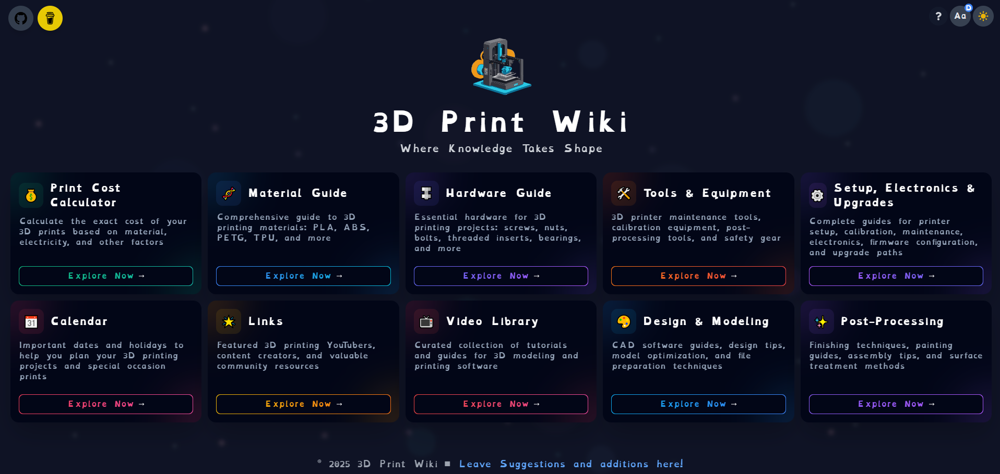

# 3D Print Wiki

## Hi there! 👋

Welcome to 3D Print Wiki! I'm just an amateur 3D printing enthusiast who wanted to collect all the bits and pieces of knowledge I've gathered along my journey. What started as personal notes has grown into this resource that I hope can help others on their 3D printing adventures!

I'm not an expert by any means - just someone who loves the hobby and has made plenty of mistakes along the way. This wiki is my way of sharing what I've learned so you might avoid some of the same pitfalls and discover the joy of 3D printing a little faster than I did.

## What You'll Find Here

This is my collection of guides, tips, and resources that have helped me in my 3D printing journey:

- **Print Cost Calculator**: Figure out exactly how much those prints are costing you
- **Material Guide**: What's the difference between PLA, PETG, and ABS? I've got notes on that!
- **Hardware Guide**: All those tiny screws and bolts that I've dropped on the floor countless times
- **Tools & Equipment**: What's actually worth buying and what you can probably skip
- **Setup & Electronics**: Lessons learned from many hours of tinkering and troubleshooting
- **Design & Finishing**: From basic designs to making your prints look amazing
- **Calendar**: Important dates I keep track of for planning special projects
- **Video Library**: The YouTube tutorials that actually helped me learn

## The Secret Command Panel! ✨

Here's a fun feature I built because I thought it was cool: press the `` ` `` (backtick) or `~` (tilde) key anywhere on the site to bring up a command panel. It lets you quickly jump between pages by typing simple commands.

### All Available Commands:
- `home` - Back to the main page
- `calc` - Jump to the calculator
- `materials` or `mat` - Materials guide
- `hardware` or `hard` - Hardware guide
- `elec` - Electronics page
- `tools` - Tools page
- `design` - Design and post-processing page
- `links` - External resources and links
- `contributors` - Contributors page
- `cale` - Calendar page
- `video` or `lib` - Video library
- `post` - Post-processing guide
- `back` - Go back to previous page

Just press `` ` ``, `~`, or Escape to close the panel.

## Join Me On This Journey

This wiki is an ongoing labor of love. I'm learning new things about 3D printing all the time, and I update this resource whenever I discover something useful. If you have suggestions or want to contribute your own knowledge, I'd be thrilled to hear from you!

This isn't meant to be the most professional or comprehensive guide out there - it's personal, sometimes messy, and definitely reflects my own biases and experiences. But I hope you find something valuable here, whether you're just starting out or have been printing for years.

Happy printing, and may your bed always be level and your filament never tangle!

## Get In Touch

If you want to chat about 3D printing or have suggestions for the wiki:
- Check out the [GitHub repo](https://github.com/pgpavlides/3dprintwiki)
- Support this project on [Buy Me a Coffee](https://buymeacoffee.com/broccolidev)

## GitHub Issues

Found a bug or have an idea to make this wiki better? I'd love to hear from you! Feel free to open an issue on GitHub:

1. Describe what you found or what you'd like to see
2. For bugs, include steps to reproduce if possible
3. For feature requests, explain how it would help fellow 3D printing enthusiasts

No need to be formal - I appreciate any feedback that can help improve this resource for everyone!

Made with ❤️ (and plenty of failed prints) by [Broccoli Dev](https://buymeacoffee.com/broccolidev)
